<p align="center">
  <a href="https://yashaggarwal85d.github.io/yashaggarwal85d/"></a>
</p>

<p align="center">
  <a href="https://yashaggarwal85d.github.io/yashaggarwal85d/"></a>
  <a href="https://www.linkedin.com/in/yashaggarwal85d/"></a>
  <a href="mailto:yashaggarwal85d@gmail.com"></a>
</p>

I build the **batch and streaming data platforms** behind semiconductor manufacturing and supply-chain planning at **Texas Instruments**: Python, SQL, PySpark, Kafka and Airflow at multi-terabyte scale, lakehouse modelling (Iceberg, Data Vault 2.0), and CI/CD on Kubernetes.

Off the clock I'm usually somewhere between a black hole, a qubit and a rewatch of *Interstellar*. My [portfolio](https://yashaggarwal85d.github.io/yashaggarwal85d/) is a 48-second showreel at 120 BPM. Move your mouse over it: the background is a keyboard.

### ☕ Freshly brewed numbers

| The shot | What went into it |
|---|---|
| 🚀 **18h → 45min** | Rebuilt monolithic cron jobs as distributed PySpark services. The nightly supply-planning run is **24× faster**, so planners can replan intra-day. |
| 🦀 **3.8× with Rust** | A Rust ETL engine that beats the previous Spark jobs per node (1.5 GB/s on identical hardware) and lands **~16 TB/day** of factory and operational data. |
| 🧊 **~6 PB / year** | Data Vault 2.0 models on an Iceberg/ClickHouse lakehouse: one governed source for planners, yield and logistics teams. |
| 📡 **< 1 s p95** | MES & ERP data streamed from sites worldwide through Kafka, with S3/Iceberg as the raw landing zone. |
| 🗄️ **136 → 1** | Merged 136 site-level databases into one distributed YugabyteDB cluster behind a Python/FastAPI layer. |
| 📦 **70K+ SKUs** | Fixed the fab-to-assembly start-signal logic, which removed ~150 manual planner overrides every week. |

### 🫘 How I brew data

```text
  Beans               Grind                  Brew                       Serve
  Kafka · MES/ERP ──▶ PySpark · Rust ETL ──▶ Iceberg · Data Vault 2.0 ──▶ ClickHouse ──▶ planners
```

### 🧰 Tech I work with

**Languages**<br/>


**Processing & orchestration**<br/>


**Lakehouse & modelling**<br/>


**Databases & warehousing**<br/>


**Cloud, IaC & DevOps**<br/>


### 🌌 Off the clock

| Interest | Why |
|---|---|
| 🕳️ **Astrophysics** | Black holes, general relativity, and how light bends around something it can't escape. |
| ⚛️ **Quantum computing** | Qubits that are both answers until you look. |
| ∑ **Maths** | *e*<sup>*iπ*</sup> + 1 = 0: five constants, one line, no notes. |
| 🎬 **Cinema** | Series, films and anime, with strong opinions about all of them. |

**On the shelf:** 🔪 *Dexter* · 🪐 *Interstellar* · 🌀 *Inception* · ↺ *Re:Zero*

### 🧑‍💻 A little more about me…

```python
yash = {
    "role": "Data Engineer II @ Texas Instruments",
    "based_in": "Bangalore, India",  # ready to relocate
    "experience": "3+ years",
    "daily_drivers": ["Python", "SQL", "PySpark", "Kafka", "Airflow", "Rust"],
    "data_at_rest": ["Iceberg", "ClickHouse", "YugabyteDB", "Oracle", "PostgreSQL"],
    "ask_me_about": ["lakehouse modelling", "Spark tuning", "streaming ingestion", "planning engines"],
    "thinks_about": ["black holes", "qubits", "e ** (1j * pi) + 1"],
    "on_repeat": ["Dexter", "Interstellar", "Inception", "Re:Zero"],
    "education": "B.E. CSE, Thapar Institute (CGPA 9.07/10)",
    "fun_fact": "There are two ways to write error-free programs; only the third one works.",
}
```

### 💼 Experience

- **Data Engineer II**, Texas Instruments · *Feb 2025 – Present*<br/>
  Rust ETL engine, Iceberg/ClickHouse lakehouse, global Kafka ingestion, rule orchestration, and the 64-week production-start planning engine.
- **Data Engineer**, Texas Instruments · *Jun 2023 – Feb 2025*<br/>
  Cut production Spark runtimes by 30–80% and took a forecasting pipeline from 24h to under 7h. Mentored 2 junior engineers and 3 interns.
- **Software Development Intern**, Texas Instruments · *Jan 2023 – Jun 2023*<br/>
  Built an internal election platform used by 10K+ employees.

### 🏆 Achievements

- 🎤 **Technical presentation to global IT leadership** (Aug 2026): presented the Rust ETL architecture at TI HQ in Dallas. Its benchmarks became the reference for TI's global data pipelines.
- 🥇 **Winner, TI India ITS Tech Hackathon** (2024): led the team that built an AI-optimised supply-chain simulator.
- ⭐ **Star of the Quarter, Texas Instruments** (Q4 2024): recognised for planning algorithms and mentorship.

### 🗄 Repositories

| | Repo | Description |
|---|---|---|
| 🎞️ | [Portfolio](./site) | This profile's website: a 48-second, 120 BPM showreel in React + three.js, on a mechanical-keyboard backdrop that reacts to your cursor. Try the Konami code. |
| 📦 | [Data Structures & Algorithms](https://github.com/yashaggarwal85d/Data-structures-and-Algorithms) | Data-structure and algorithm implementations in C++. |
| 📦 | [ProjectX1](https://github.com/yashaggarwal85d/ProjectX1) | A collaboration platform where team members and clients join projects and work through raised issues. |
| 📦 | [Blockchain](https://github.com/yashaggarwal85d/Blockchain) | A web and mobile chat app with public, private and anonymous modes, backed by encrypted data on a blockchain. |

<p align="center"><em>Got data at petabyte scale, or a film I should watch next? My <a href="mailto:yashaggarwal85d@gmail.com">inbox</a> is open ☕</em></p>
<p align="center"><sub>↺ This README loops too. Scroll back up.</sub></p>
